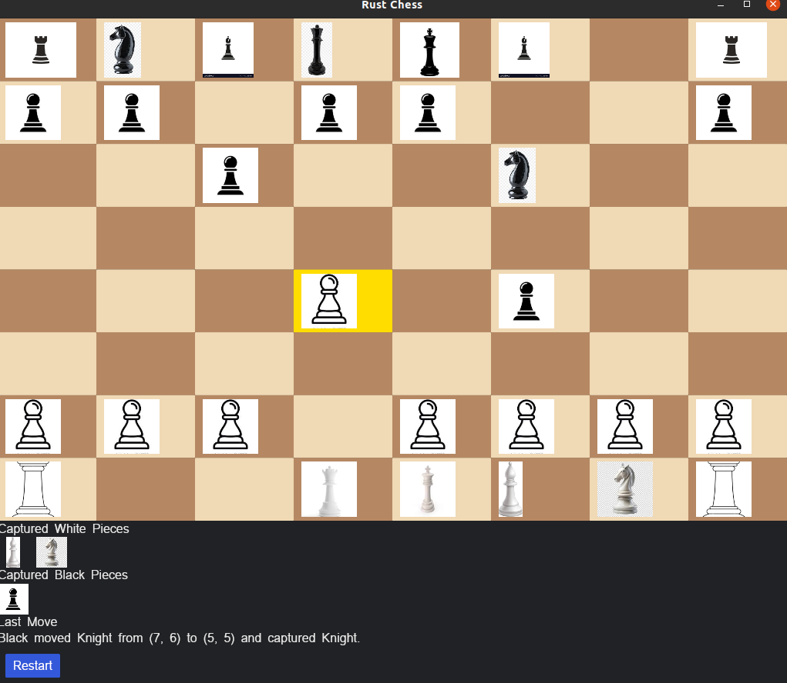
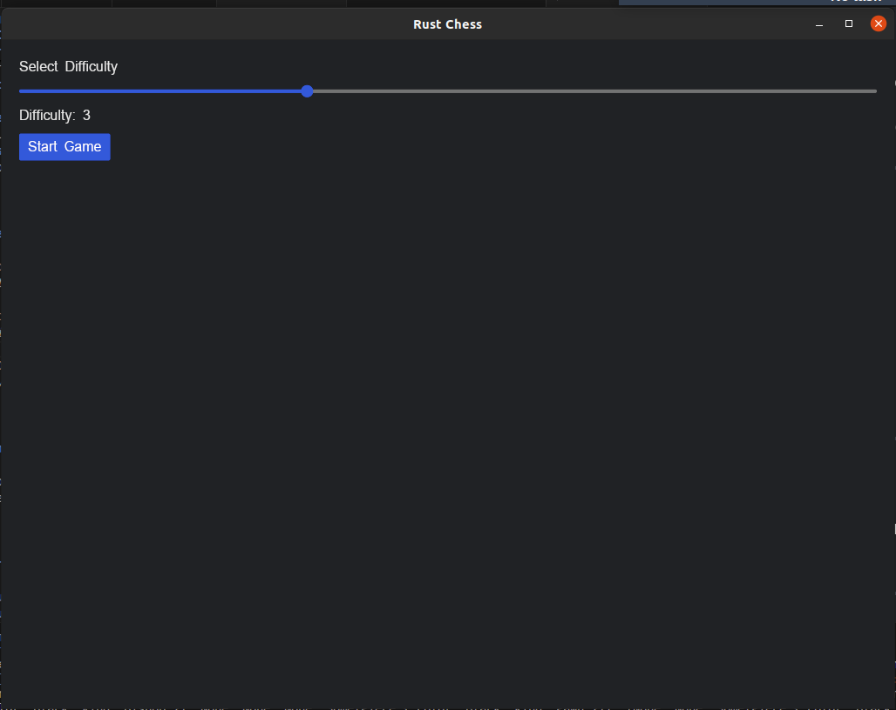
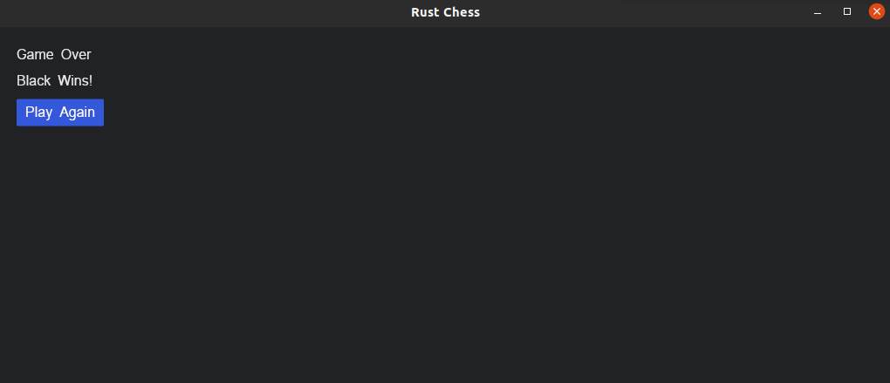

# Rust Chess 🏁

Rust Chess is a fully functional chess game implemented in Rust, featuring a chess engine with move generation, validation, and an AI opponent. The game is built using the `iced` framework for the user interface, providing a clean and interactive experience. This project is a great example of combining game logic with a modern GUI framework in Rust.

---

## Features 🎮

### Chess Engine
- **Piece Movement**: Supports all standard chess pieces (pawn, knight, bishop, rook, queen, king) with their respective movement rules.
- **Special Moves**:
  - **Castling**: Kingside and queenside castling.
  - **En Passant**: Capturing pawns en passant.
  - **Pawn Promotion**: Promotes pawns to queens when they reach the opposite side of the board.
- **Game State Management**:
  - **Check and Checkmate**: Detects when a king is in check or checkmate.
  - **Stalemate and Draws**: Handles stalemates, the 50-move rule, and insufficient material draws.
- **Move Validation**: Ensures all moves are legal and do not leave the king in check.

### AI Opponent 🤖
- **Minimax Algorithm**: The AI uses a minimax algorithm with alpha-beta pruning to determine the best move.
- **Difficulty Levels**: Adjustable difficulty (depth of search) from 1 (easiest) to 7 (hardest).
- **Parallel Computation**: Uses the `rayon` crate to parallelize move evaluation for better performance.

### User Interface 🖥️
- **Interactive Chessboard**: Clickable squares with highlighted selections and valid moves.
- **Captured Pieces Display**: Shows captured pieces for both players.
- **Last Move Display**: Displays the last move made by either player.
- **Difficulty Slider**: Allows players to adjust the AI difficulty before starting the game.
- **Restart Button**: Resets the game to the initial state.

---

## Project Structure 🗂️

### `engine.rs`
This module contains the core logic of the chess engine:
- **Piece Definitions**: Enums for `Color` and `PieceType`, along with methods for piece movement.
- **Board State**: Manages the state of the board, including piece positions, castling rights, en passant targets, and the half-move clock.
- **Move Generation**: Generates valid moves for each piece and validates them.
- **AI Logic**: Implements the minimax algorithm with alpha-beta pruning for the AI opponent.

### `main.rs`
This module handles the user interface and game flow:
- **Game State**: Tracks the current state of the game (e.g., selecting difficulty, playing, game over).
- **UI Rendering**: Uses the `iced` framework to render the chessboard, captured pieces, and controls.
- **Event Handling**: Processes user inputs (e.g., clicking squares, adjusting difficulty, restarting the game).

---

## How to Play 🎲

1. **Select Difficulty**:
   - When the game starts, use the slider to select the AI difficulty (1 = easiest, 7 = hardest).
   - Click "Start Game" to begin.

2. **Make Moves**:
   - Click on a piece to select it. The selected square will be highlighted.
   - Click on a valid destination square to move the piece.
   - The game will automatically switch to the AI's turn after your move.

3. **Game Over**:
   - The game ends when a checkmate or draw condition is met.
   - A message will display the result (e.g., "White Wins!" or "It's a Draw!").
   - Click "Play Again" to restart the game.

---

## Dependencies 📦

- **[`iced`](https://github.com/iced-rs/iced)**: A cross-platform GUI library for Rust, used for rendering the game interface.
- **[`rayon`](https://github.com/rayon-rs/rayon)**: A data parallelism library for Rust, used to parallelize the AI's move evaluation.

---

## Running the Game 🚀

### Prerequisites
- Ensure you have Rust installed. If not, install it from [rustup.rs](https://rustup.rs/).

### Steps
1. Clone the repository:
   ```bash
   git clone https://github.com/wdcs-pruthvithakor/chess-rust.git
   cd chess-rust
   ```
2. Run the game:
   ```bash
   cargo run
   ```

---

## Future Improvements 🔮

- **Enhanced AI**:
  - Implement iterative deepening for better move selection.
  - Add quiescence search to handle volatile positions.
  - Improve the evaluation function with piece-square tables and advanced heuristics.
- **UI Enhancements**:
  - Improve the overall design and responsiveness.
- **Multiplayer Support**:
  - Add support for online or local multiplayer.
- **Save/Load Game**:
  - Implement the ability to save and load game states.
- **Chess Variants**:
  - Support for chess variants like Fischer Random Chess (Chess960).

---

## Screenshots 📸

  
*The interactive chessboard with highlighted moves.*

  
*Selecting the AI difficulty before starting the game.*

  
*Game over screen displaying the winner.*

---

## License 📜

This project is open-source and available under the **MIT License**. Feel free to use, modify, and distribute it as you see fit.

---

## Contributing 🤝

Contributions are welcome! If you have any suggestions, bug reports, or feature requests, please open an issue or submit a pull request.

---

Enjoy playing Rust Chess! ♟️